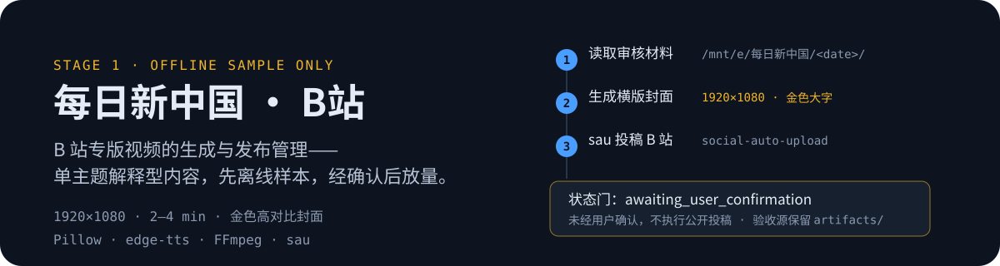

<p align="center">
  
</p>

<p align="center">
  
  &nbsp;
  
  &nbsp;
  
  &nbsp;
  
</p>

# 每日新中国b站

> Language: 中文

独立的 B站专版视频制作与发布管理仓库。

## 当前阶段

阶段一只生成一条离线样本，不自动公开投稿：

- 日期：2026-07-17
- 主题：国产14米级超大直径盾构机“先锋号”下线
- 视频：1920×1080、16:9、2–4分钟、单主题解释型内容
- 封面：1920×1080、单一主体、金色高对比大字
- 状态上限：`awaiting_user_confirmation`

## 不变量

- 从 `/mnt/e/每日新中国/<date>/` 读取审核材料。
- 不修改旧《每日新中国》生成和跨平台发布流程代码。
- 验收源保留在本仓库 `artifacts/<date>/`；通过验收后，发布包同步到
  `/mnt/e/每日新中国/<date>/video/每日新中国b站/`，与其他单件视频同级。
- 不复用旧流程最终 MP4。
- 未经用户确认，不执行 `sau bilibili upload-video`。
- 本仓库使用现有 Python、Pillow、requests、edge-tts、FFmpeg，不安装新依赖。

## 计划中的命令

```bash
python3 -m unittest discover -s tests -v
python3 scripts/build_sample.py --date 2026-07-17
python3 scripts/verify_sample.py --date 2026-07-17
python3 scripts/preview_publish.py --date 2026-07-17
```

最后一条永远不执行投稿。当前运输层已就绪，预览命令包含 `--thumbnail`。
仅当用户明确指示后，才执行真实投稿。

## 许可证

本项目公开可见，但不是开源软件。个人学习者仅可在本机非商业运行未经修改的副本；
未经书面许可，不得修改、分发、公开部署、提供服务或商用。完整条款见 [LICENSE.md](LICENSE.md)。
